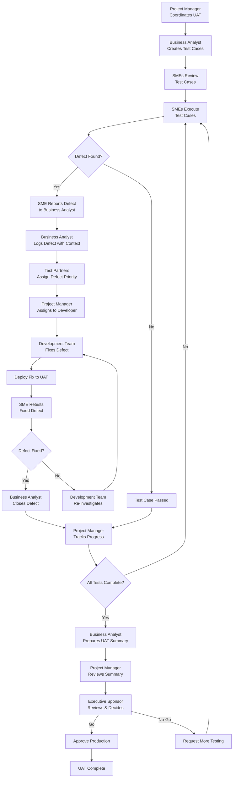

# Activity 4 – Roles & Responsibilities (Group Task)

**System:** Work Readiness Management System  
**UAT Phase:** User Acceptance Testing  
**Date:** December 2024

---

## 📋 Table of Contents
1. [Key Roles Identification](#1-key-roles-identification)
2. [Roles & Responsibilities Matrix](#2-roles--responsibilities-matrix)
3. [Role Interaction Flow](#3-role-interaction-flow)
4. [Role-Play Scenario](#4-role-play-scenario)
5. [Written Explanation of Interactions](#5-written-explanation-of-interactions)

---

## 1. KEY ROLES IDENTIFICATION

### Primary UAT Roles

The User Acceptance Testing (UAT) process for the Work Readiness Management System involves the following key roles:

1. **Project Manager (PM)**
2. **Business Analyst (BA)**
3. **Subject Matter Experts (SMEs) / Business Users**
4. **Test Partners / QA Team**
5. **Development Team**
6. **Executive Sponsor / Stakeholders**

---

## 2. ROLES & RESPONSIBILITIES MATRIX

| Role | Primary Responsibilities | Key Activities | Deliverables |
|------|-------------------------|----------------|--------------|
| **Project Manager** | • Plan and coordinate UAT activities • Manage timelines and resources • Track progress and escalate issues • Ensure deliverables are met | • Schedule UAT sessions • Coordinate with all stakeholders • Track daily progress • Conduct status meetings • Manage risks and blockers | • UAT Plan Document • UAT Schedule • Status Reports • Risk Register • UAT Summary Report |
| **Business Analyst** | • Create test scenarios and cases • Assist SMEs in understanding requirements • Document test results • Analyze defects from business perspective • Bridge gap between technical and business teams | • Write test cases • Review test cases with SMEs • Document test execution results • Log defects with business context • Prepare UAT reports | • Test Case Document • Test Execution Reports • Defect Log (Business Context) • UAT Summary Report |
| **Subject Matter Experts (SMEs)** | • Execute test cases • Validate business workflows • Report defects and issues • Provide feedback on usability • Approve or reject functionality | • Perform actual testing • Validate workflows match business needs • Report issues found • Retest fixed defects • Provide sign-off | • Test Execution Results • Defect Reports • Feedback/Comments • Sign-off Approval |
| **Test Partners / QA Team** | • Provide testing expertise • Assist in test case design • Manage defect tracking system • Ensure test coverage • Provide testing tools and support | • Set up defect tracking system • Train SMEs on defect logging • Perform regression testing • Ensure test quality • Provide testing tools | • Defect Tracking System Setup • Test Coverage Report • Regression Test Results • Testing Tools Documentation |
| **Development Team** | • Fix defects identified during UAT • Provide technical clarifications • Deploy fixes to UAT environment • Support troubleshooting | • Investigate defects • Fix code issues • Deploy fixes to UAT • Provide technical support | • Fixed Defects • Deployment to UAT • Technical Documentation |
| **Executive Sponsor** | • Review UAT results • Make go/no-go decisions • Provide final sign-off • Allocate resources if needed | • Review UAT summary report • Assess defect status • Make deployment decision • Approve production release | • Go/No-Go Decision • Final Sign-off Document • Production Approval |

---

## 3. ROLE INTERACTION FLOW

### Visual Flow Diagram

---

## 4. ROLE-PLAY SCENARIO

### Scenario: Testing Worker Incident Reporting Feature

**Setting:** UAT Session - Day 3 of Testing  
**Feature:** Worker Incident Reporting Module  
**Participants:** All UAT roles

---

#### Scene 1: Test Case Preparation

**Business Analyst (Sarah):**  
"Good morning everyone. Today we'll be testing the Worker Incident Reporting feature. I've prepared test cases UAT-009 through UAT-016. Sarah, as our Worker SME, you'll be executing these tests. The test cases cover incident submission, validation, AI analysis, and viewing incident history."

**Project Manager (Mike):**  
"Thanks, Sarah. Let's make sure we have the UAT environment ready. John from QA, can you confirm the test data is loaded?"

**Test Partner (John):**  
"Yes, Mike. We have 5 test worker accounts ready, and I've set up the defect tracking system. Sarah, I'll show you how to log defects properly if you find any issues."

**SME - Worker (Sarah):**  
"Perfect. I've reviewed the test cases and they look good. I understand I need to test as if I'm a real worker reporting an incident. Let me start with UAT-009."

---

#### Scene 2: Test Execution and Defect Discovery

**SME - Worker (Sarah):**  
*[Executing test case UAT-009]*  
"Hmm, I'm trying to submit an incident report, but when I upload a photo that's 6MB, I'm getting an error. According to the test case, it should accept up to 5MB, but the error message says 'Photo size must be less than 5MB' - which is correct, but I think the validation is working. Wait, let me check the test case again..."

**Business Analyst (Sarah):**  
"Sarah, what's happening? Is this a defect or expected behavior?"

**SME - Worker (Sarah):**  
"Actually, I think this is working correctly. The system is properly rejecting files over 5MB. But I found something else - when I try to submit without filling the location field, the error message appears but it's not very clear. It just says 'Please provide the location' but it doesn't highlight the field."

**Business Analyst (Sarah):**  
"That's a usability issue. Let me log this as a defect. Can you provide more details? What browser are you using?"

**SME - Worker (Sarah):**  
"I'm using Chrome on Windows. The error message appears at the top, but the location field itself doesn't have a red border or any visual indicator."

**Business Analyst (Sarah):**  
*[Logging defect in system]*  
"Defect logged: DEF-045 - Form validation error not visually clear. Priority: Medium. John, can you assign this to the development team?"

**Test Partner (John):**  
"Done. I've assigned it to the frontend team with priority Medium. The defect is now in the tracking system."

---

#### Scene 3: Defect Resolution and Retesting

**Project Manager (Mike):**  
*[Later that day]*  
"Team, we have 3 defects logged today. The development team has fixed DEF-045 - the form validation issue. Sarah, can you retest this?"

**SME - Worker (Sarah):**  
*[Retesting the fixed defect]*  
"Yes, I'm testing it now. The location field now has a red border when there's an error, and the error message is clearer. This looks good! I'll mark it as passed."

**Business Analyst (Sarah):**  
"Great! I'll update the defect status to 'Closed - Verified'. We now have 2 remaining defects. Let's continue with the other test cases."

---

#### Scene 4: Daily Status Update

**Project Manager (Mike):**  
"Let's do our end-of-day status update. Sarah, what's our progress?"

**Business Analyst (Sarah):**  
"Today we executed 8 test cases. 6 passed, 1 failed (which led to DEF-045 that's now fixed), and 1 is blocked waiting for DEF-046 to be fixed. We logged 3 new defects today."

**Test Partner (John):**  
"Defect summary: 1 Critical (DEF-046), 2 Medium (DEF-045 - fixed, DEF-047), 1 Low (DEF-048). DEF-045 is closed. The development team is working on DEF-046."

**SME - Worker (Sarah):**  
"The testing is going well. The system is mostly working as expected. The main issues are around user experience and error messages, not functionality."

**Project Manager (Mike):**  
"Good progress. We're on track. Let's continue tomorrow with the Team Leader approval workflow tests. Sarah, can you prepare those test cases for review?"

**Business Analyst (Sarah):**  
"Already prepared. I'll send them to the Team Leader SME for review tonight."

---

#### Scene 5: UAT Completion and Sign-off

**Project Manager (Mike):**  
*[Final UAT meeting]*  
"Team, we've completed all UAT test cases. Sarah, can you present the summary?"

**Business Analyst (Sarah):**  
"UAT Summary: We executed 35 test cases total. 32 passed (91%), 2 failed and were fixed, 1 deferred to next release. We logged 8 defects: 1 Critical (fixed), 4 Medium (all fixed), 3 Low (2 fixed, 1 deferred). All critical and high-priority defects are resolved. The system is ready for production."

**SME - Worker (Sarah):**  
"As a worker user, I'm satisfied with the system. It meets our business needs. I approve."

**SME - Team Leader (David):**  
"I've tested the approval workflow extensively. It works well. I approve."

**Test Partner (John):**  
"From a QA perspective, the system has good test coverage and all critical paths are working. I recommend approval."

**Project Manager (Mike):**  
"Thank you all. I'll prepare the final UAT summary report and present it to the Executive Sponsor for final sign-off."

**Executive Sponsor (Lisa):**  
*[Reviewing UAT summary]*  
"Based on the UAT results, I'm satisfied with the quality. All critical defects are resolved, and we have SME approval. I approve the system for production deployment. Well done, team!"

---

## 5. WRITTEN EXPLANATION OF INTERACTIONS

### How Roles Interact During UAT

#### Phase 1: UAT Planning & Preparation

**Interaction Flow:**
1. **Project Manager** initiates UAT planning and coordinates with all stakeholders
2. **Business Analyst** works with **SMEs** to understand business requirements and create test cases
3. **Test Partners** set up the testing environment and defect tracking system
4. **Project Manager** schedules UAT sessions and allocates resources
5. **Business Analyst** reviews test cases with **SMEs** to ensure they understand what to test

**Key Interactions:**
- PM ↔ BA: Planning and coordination
- BA ↔ SMEs: Requirement clarification and test case review
- PM ↔ Test Partners: Environment setup coordination
- All Roles: Kickoff meeting to align on objectives

---

#### Phase 2: Test Execution

**Interaction Flow:**
1. **SMEs** execute test cases using test data prepared by **Test Partners**
2. **SMEs** report issues to **Business Analyst** when defects are found
3. **Business Analyst** logs defects in the tracking system with business context
4. **Test Partners** review defects and assign priority/severity
5. **Project Manager** assigns defects to **Development Team** based on priority
6. **Business Analyst** tracks test execution progress and updates test results

**Key Interactions:**
- SMEs → BA: Defect reporting and test results
- BA → Test Partners: Defect logging and clarification
- PM → Development Team: Defect assignment and prioritization
- BA ↔ PM: Daily progress updates

---

#### Phase 3: Defect Resolution & Retesting

**Interaction Flow:**
1. **Development Team** investigates and fixes defects assigned by **Project Manager**
2. **Development Team** deploys fixes to UAT environment
3. **Project Manager** notifies **Business Analyst** that fixes are ready
4. **Business Analyst** coordinates with **SMEs** to retest fixed defects
5. **SMEs** retest and verify fixes work correctly
6. **Business Analyst** updates defect status based on retest results
7. If defect is not fixed, the cycle repeats (Development Team re-investigates)

**Key Interactions:**
- Development Team → PM: Fix completion notification
- PM → BA: Fix ready notification
- BA → SMEs: Retest coordination
- SMEs → BA: Retest results
- BA → Development Team: Defect status updates

---

#### Phase 4: UAT Completion & Sign-off

**Interaction Flow:**
1. **Business Analyst** compiles all test results and prepares UAT summary report
2. **Project Manager** reviews the summary and presents to **Executive Sponsor**
3. **SMEs** provide final approval/sign-off based on their testing experience
4. **Test Partners** provide QA perspective and recommendations
5. **Executive Sponsor** reviews all information and makes go/no-go decision
6. If approved, **Project Manager** coordinates production deployment
7. If not approved, **Project Manager** coordinates additional testing

**Key Interactions:**
- BA → PM: UAT summary report
- PM → Executive Sponsor: Presentation and recommendation
- SMEs → PM: Final approval/sign-off
- Test Partners → PM: QA recommendations
- Executive Sponsor → PM: Final decision

---

### Communication Patterns

#### Daily Interactions:
- **Morning Stand-up:** PM, BA, Test Partners, SMEs (15 minutes)
  - Review yesterday's progress
  - Plan today's testing activities
  - Identify blockers

- **Defect Triage Meeting:** PM, BA, Test Partners, Development Team Lead (30 minutes, as needed)
  - Review new defects
  - Assign priority and ownership
  - Plan fix timeline

- **End-of-Day Status:** PM, BA, Test Partners (15 minutes)
  - Update progress metrics
  - Review defect status
  - Plan next day activities

#### Weekly Interactions:
- **UAT Status Meeting:** All roles (1 hour)
  - Review weekly progress
  - Discuss risks and issues
  - Adjust plan if needed
  - Executive Sponsor attends for major decisions

---

### Decision-Making Authority

| Decision Type | Decision Maker | Consultation Required |
|--------------|----------------|----------------------|
| Test Case Content | Business Analyst | SMEs (for business validation) |
| Defect Priority | Test Partners | Business Analyst, PM |
| Defect Assignment | Project Manager | Development Team Lead |
| Test Schedule Changes | Project Manager | All stakeholders |
| Scope Changes | Executive Sponsor | Project Manager, BA |
| Go/No-Go Decision | Executive Sponsor | All roles (input) |
| Production Deployment | Executive Sponsor | Project Manager |

---

### Conflict Resolution

**Scenario:** SME finds an issue but BA thinks it's not a defect

**Resolution Process:**
1. **SME** reports issue to **BA**
2. **BA** reviews against requirements
3. If disagreement, **BA** consults with **Test Partners** for technical perspective
4. If still unclear, escalate to **Project Manager**
5. **PM** may consult **Development Team** or **Executive Sponsor** for final decision
6. Decision documented and communicated to all

---

### Success Factors for Role Interaction

1. **Clear Communication:** Regular meetings and status updates
2. **Defined Processes:** Clear workflows for defect logging and resolution
3. **Respect for Expertise:** Each role's expertise is valued and consulted
4. **Collaborative Approach:** Team works together, not in silos
5. **Documentation:** All interactions and decisions are documented
6. **Timely Response:** Quick turnaround on defect fixes and retesting
7. **Shared Goals:** All roles aligned on UAT success criteria

---

## Summary

The UAT process for the Work Readiness Management System involves coordinated interaction between six key roles:

- **Project Manager** orchestrates the entire process
- **Business Analyst** bridges business and technical worlds
- **SMEs** provide real-world validation
- **Test Partners** ensure quality and process
- **Development Team** fixes issues
- **Executive Sponsor** makes final decisions

Effective interaction requires clear communication, defined processes, and collaborative teamwork. Each role brings unique expertise that, when combined, ensures a thorough and successful UAT process.

---

**End of Activity 4 - Roles & Responsibilities**
